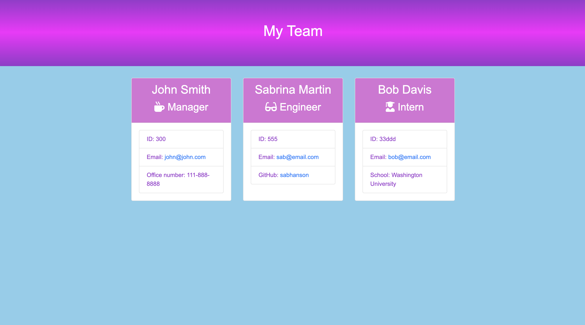

# HW10-Team Generator Application  

## Description
I created this application to generate an HTML file of a professional team using the built-in terminal of VSCode. The user can easily run this code to built a neatly-formatted HTML file that will display their manager, developers, and interns, including their contact information with clickable links. 

## Table of Contents
- [Installation](#installation)
- [Usage](#usage)
- [License](#license)
- [Contributing](#contributing)
- [Tests](#tests)
- [Questions](#questions)

## Installation
To install this Team Generator Application, the user will need to create a clone of this repository and open it in VSCode. The user will need to have npm installed to be able to run this application in the built-in terminal.  

[For more information on installing npm](https://docs.npmjs.com/cli/v8/commands/npm-install)  

The user will need to right-click on the index.js file and select "open in integrated terminal". Then run the command "npm i inquirer" to install the inquirer package. After that, run the command "node index.js" to start generating a team with the application. 

## Usage
The user will need to follow the Installation instructions above.
- Then they will be prompted with their first questions regarding the Manager.
- Once the user has answered all questions about the Manager, they will be prompted to choose one of the following: "Add an Engineer", "Add an Intern", or "I'm done building my team. Quit application".
- If the user selects "Add an Engineer", they will answer specific questions that pertain to an Engineer's position.
- If the user selects "Add an Intern", they will answer specific questions that pertain to the Intern's position.
- If the user selects to add an engineer or intern, they will continue to be asked to add more team members until they select "I'm done building my team. Quit application".
- Once that option is selected, the user will be finished with the application and the HTML will be generated in the 'dist' folder under the name 'index.html'. Be mindful that each time this application is run, the previous data saved in 'index.html' will be overwritten. To save any data from versions of this file, copy and save to somewhere other than this folder.  

I have provided a link to a YouTube video demoing the application usage, and the HTML file that is generated.  

[Youtube Video of Team Generator Application Usage, and Demo](https://youtu.be/OfmjLIGupDM)

## License
MIT License

Copyright &copy; 2022 Sabrina Hanson

Permission is hereby granted, free of charge, to any person obtaining a copy
of this software and associated documentation files (the "Software"), to deal
in the Software without restriction, including without limitation the rights
to use, copy, modify, merge, publish, distribute, sublicense, and/or sell
copies of the Software, and to permit persons to whom the Software is
furnished to do so, subject to the following conditions:

The above copyright notice and this permission notice shall be included in all
copies or substantial portions of the Software.

THE SOFTWARE IS PROVIDED "AS IS", WITHOUT WARRANTY OF ANY KIND, EXPRESS OR
IMPLIED, INCLUDING BUT NOT LIMITED TO THE WARRANTIES OF MERCHANTABILITY,
FITNESS FOR A PARTICULAR PURPOSE AND NONINFRINGEMENT. IN NO EVENT SHALL THE
AUTHORS OR COPYRIGHT HOLDERS BE LIABLE FOR ANY CLAIM, DAMAGES OR OTHER
LIABILITY, WHETHER IN AN ACTION OF CONTRACT, TORT OR OTHERWISE, ARISING FROM,
OUT OF OR IN CONNECTION WITH THE SOFTWARE OR THE USE OR OTHER DEALINGS IN THE
SOFTWARE.

## Contributing
To contribute, please contact me.

## Tests
Tested in VSCode terminal for errors and proper usage.  
Also tested using Jest.

## Questions
To contact me, use one of the links below:  
[Github Profile](https://www.github.com/sabhanson)  
[Email Me](mailto:sabhanson7@gmail.com)
